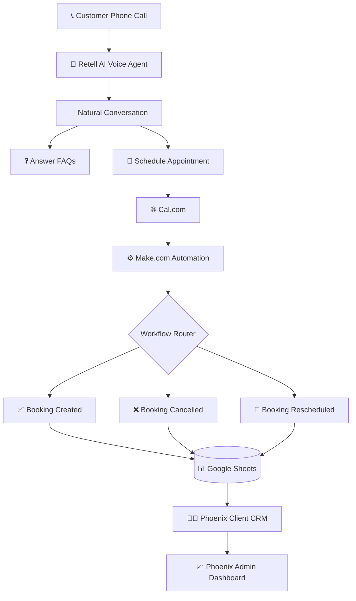

<!-- ====================================================== -->
<!--                  PHOENIX AI -->
<!-- ====================================================== -->

<h1 align="center">

🤖 Phoenix AI Voice Receptionist

</h1>

<h3 align="center">

Enterprise AI Appointment Automation Platform

</h3>

<p align="center">

Deploy intelligent AI receptionists that answer calls, schedule appointments, automate workflows, and manage customers through a modern CRM ecosystem.

</p>

---

<p align="center">


</p>

---

<p align="center">

<a href="https://phoenix-ai-dashboard.netlify.app">


</a>

<a href="https://phoenix-ai-crm.netlify.app">


</a>

<a href="https://github.com/Rajaubaid786/Phoenix-AI-Dashboard">


</a>

<a href="https://github.com/Rajaubaid786/Phoenix-AI-CRM">


</a>

</p>

---

# ⚡ What is Phoenix AI?

Phoenix AI is an enterprise-grade **AI Voice Receptionist Platform** developed as a **Final Year Project** to automate customer communication, appointment scheduling, and business operations through conversational AI.

Instead of relying on a traditional receptionist, businesses can deploy an intelligent voice assistant capable of answering incoming phone calls, understanding natural language, booking appointments, handling cancellations and rescheduling requests, while automatically synchronizing customer records across multiple integrated systems.

The platform combines conversational AI, workflow automation, scheduling services, cloud databases, and custom-built management portals into one seamless ecosystem.

---

# 🌟 Why Phoenix AI?

Traditional businesses often struggle with:

- ❌ Missed customer calls
- ❌ Manual appointment booking
- ❌ Receptionist workload
- ❌ Human errors
- ❌ No centralized customer records
- ❌ Time-consuming follow-ups

Phoenix AI solves these challenges by providing:

- ✅ AI-powered voice receptionist
- ✅ 24/7 automated customer support
- ✅ Intelligent FAQ handling
- ✅ Real-time appointment scheduling
- ✅ Automated cancellations & rescheduling
- ✅ Workflow automation
- ✅ Live CRM synchronization
- ✅ Business analytics dashboard
- ✅ Multi-client management

---

# 🚀 Platform Highlights

| Feature | Description |
|----------|-------------|
| 🤖 AI Receptionist | Human-like voice conversations powered by Retell AI |
| 📅 Smart Scheduling | Automatic appointment booking using Cal.com |
| ⚙️ Workflow Automation | Make.com automations with intelligent routing |
| 📊 CRM Portal | Client booking history and analytics |
| 📈 Admin Dashboard | Agency-wide monitoring and revenue analytics |
| 📋 Google Sheets Integration | Cloud-based booking database |
| 🔄 Booking Management | Create, Cancel & Reschedule workflows |
| 🔔 Live Synchronization | Instant CRM updates after every booking |
| 📞 FAQ Handling | AI answers business-specific customer questions |
| 🏢 Multi-Business Support | Dedicated AI receptionist for each client |

---

# 🏆 Key Features

## 🤖 AI Voice Receptionist

- Human-like conversations
- Context-aware responses
- FAQ answering
- Appointment booking
- Appointment cancellation
- Appointment rescheduling
- Business-specific knowledge
- Natural voice interaction

---

## 📅 Smart Appointment Scheduling

- Live availability checking
- Calendar synchronization
- Automated booking confirmation
- Conflict prevention
- Time-slot management
- Service selection
- Customer information capture

---

---

# 🏗️ Enterprise System Architecture

Phoenix AI follows a modular architecture where every component is responsible for a specific stage of the customer journey—from answering phone calls to updating the client's CRM in real time.



---

# 🔄 AI Workflow

```text
                     CUSTOMER

                         │

                         ▼

              📞 Calls Business Number

                         │

                         ▼

              🤖 Retell AI Receptionist

      ┌──────────────────────────────────────┐
      │                                      │
      │  • Greets Customer                   │
      │  • Understands Natural Language      │
      │  • Answers FAQs                      │
      │  • Books Appointment                 │
      │  • Cancels Appointment               │
      │  • Reschedules Appointment           │
      │                                      │
      └──────────────────────────────────────┘

                         │

                         ▼

                 📅 Cal.com Scheduling

                         │

                         ▼

               ⚙️ Make.com Automation

                         │

                         ▼

                 Intelligent Router

        ┌────────────┬────────────┬────────────┐

        ▼            ▼            ▼

   Booking      Cancellation    Reschedule

        │            │            │

        └────────────┴────────────┘

                     │

                     ▼

          📊 Google Sheets Database

                     │

                     ▼

          👨‍⚕️ Phoenix Client CRM

                     │

                     ▼

         👨‍💼 Phoenix Admin Dashboard
```

---

# ⚙️ Automation Pipeline

Every appointment automatically passes through an intelligent automation pipeline.

### ✅ Booking Created

- AI confirms appointment
- Cal.com creates booking
- Make.com receives webhook
- Customer data is extracted
- Booking record is created
- Google Sheets database updates
- Client CRM updates instantly

---

### ❌ Booking Cancelled

- Webhook received
- Existing booking searched
- Status updated
- CRM synchronized
- Booking marked as **Cancelled**

---

### 🔄 Booking Rescheduled

- Existing customer located
- Appointment updated
- Date & Time replaced
- CRM synchronized
- Booking marked as **Rescheduled**

---

# 📊 Database Structure

Every booking is automatically stored in a centralized cloud database.

| Field | Description |
|-------|-------------|
| 👤 Name | Customer Name |
| 📧 Email | Customer Email |
| 📱 Phone | Contact Number |
| 📅 Date | Appointment Date |
| 🕒 Time | Appointment Time |
| 🦷 Service | Requested Service |
| ⏰ Created At | Booking Timestamp |
| 📌 Status | Created / Cancelled / Rescheduled |

---

# 📸 Platform Showcase

## 👨‍💼 Phoenix Admin Dashboard

The Admin Dashboard provides a centralized view for managing multiple client businesses, AI agents, subscriptions, payments, and operational analytics.

### Highlights

- 📊 Revenue Analytics
- 👥 Client Management
- 🤖 AI Monitoring
- 💰 Subscription Tracking
- 🔔 Notifications
- 📈 Business Insights
- ⚡ Live Activity Feed
- 📋 AI System Status

> 📷 **Screenshot**

```text
screenshots/admin-dashboard.png
```

---

## 👨‍⚕️ Phoenix Client CRM

Each business receives a dedicated CRM where staff can monitor appointments generated by the AI receptionist.

### Highlights

- 📅 Booking Dashboard
- 📈 Booking Analytics
- 📋 Appointment History
- 👥 Customer Records
- 🔍 Search & Filtering
- ❌ Cancelled Appointments
- 🔄 Rescheduled Bookings
- 🤖 AI Performance Overview

> 📷 **Screenshot**

```text
screenshots/client-crm.png
```

---

# 💡 Real-World Use Cases

Phoenix AI is suitable for businesses that receive appointments over phone calls.

Examples include:

- 🦷 Dental Clinics
- 🏥 Hospitals
- 👨‍⚕️ Private Doctors
- 💇 Salons
- 💆 Beauty Clinics
- ⚖️ Law Firms
- 🏢 Consultants
- 🏋️ Fitness Centers
- 🚗 Service Workshops
- 🧑‍🏫 Coaching Centers

---

---

# 🛠️ Technology Stack

## 🤖 Artificial Intelligence

| Technology | Purpose |
|------------|---------|
| 🤖 Retell AI | Conversational Voice AI |
| 🧠 Prompt Engineering | AI Agent Behavior |
| 🎙️ Natural Language Processing | Human-like Conversations |

---

## 📅 Scheduling & Automation

| Technology | Purpose |
|------------|---------|
| 📅 Cal.com | Appointment Scheduling |
| ⚙️ Make.com | Workflow Automation |
| 🔗 Webhooks | Event Communication |
| 🔀 Router | Intelligent Workflow Routing |

---

## 💻 Frontend

| Technology | Purpose |
|------------|---------|
| ⚛️ React.js | Frontend Framework |
| ⚡ Vite | Development Environment |
| 🎨 Tailwind CSS | UI Design |
| ✨ Framer Motion | Animations |
| 📊 Recharts | Analytics Charts |
| 🎯 React Icons | Icons |

---

## ⚙️ Backend

| Technology | Purpose |
|------------|---------|
| 📜 Google Apps Script | Serverless Backend |
| 🔗 REST APIs | Communication |
| 🌐 Fetch API | Data Transfer |

---

## 🗄️ Database

| Technology | Purpose |
|------------|---------|
| 📊 Google Sheets | Cloud Database |
| ☁️ Google Workspace | Data Storage |

---

## 🧰 Development Tools

| Technology | Purpose |
|------------|---------|
| 🐙 Git | Version Control |
| 📂 GitHub | Repository Hosting |
| 💻 VS Code | Development |
| 🎨 Figma | UI Design |
| 🚀 Netlify | Deployment |

---

# 📁 Repository Structure

```text
AI-Voice-Receptionist-FYP
│
├── 📂 assets/
│      ├── banner.png
│      └── logo.png
│
├── 📂 architecture/
│      ├── system-architecture.png
│      └── workflow.png
│
├── 📂 screenshots/
│      ├── dashboard/
│      ├── crm/
│      ├── automation/
│      ├── ai-agent/
│      └── analytics/
│
├── 📂 docs/
│      ├── project-report.pdf
│      ├── workflow.pdf
│      └── architecture.pdf
│
└── README.md
```

---

# 📂 Related Repositories

<table>

<tr>

<td align="center" width="50%">

## 🖥️ Phoenix AI Dashboard

Agency Management Dashboard

📊 Revenue Analytics

👥 Client Management

🤖 AI Monitoring

💰 Subscription Tracking

🔔 Notifications

📈 Business Insights

➡️ **View Repository**

</td>

<td align="center" width="50%">

## 👨‍⚕️ Phoenix AI CRM

Client Management Portal

📅 Appointment Tracking

👥 Customer Database

📈 Analytics

🔄 Booking Management

🔍 Search & Filters

➡️ **View Repository**

</td>

</tr>

</table>

---

# 🎯 Skills Demonstrated

### 🤖 Artificial Intelligence

- Conversational AI
- Prompt Engineering
- AI Workflow Design
- Voice Automation

---

### ⚙️ Automation

- Workflow Automation
- API Integration
- Webhook Processing
- Event Driven Systems

---

### 🌐 Full Stack Development

- React.js
- Tailwind CSS
- Google Apps Script
- REST APIs

---

### 📊 Business Systems

- CRM Development
- Dashboard Development
- Analytics
- SaaS Architecture

---

### 📅 Scheduling Systems

- Appointment Automation
- Calendar Integration
- Booking Management

---

# 🚀 Future Roadmap

- 🌍 Multi-language Voice Support
- 💳 Stripe Payment Integration
- 📱 SMS Notifications
- 💬 WhatsApp Integration
- 📧 Email Notifications
- 🎙️ Voice Cloning
- 🔐 Role-Based Access Control
- 🐳 Docker Deployment
- ☁️ AWS Cloud Deployment
- 📞 Outbound AI Calling
- 📈 Advanced Analytics Dashboard
- 🤖 AI Sentiment Analysis

---

# 📚 Documentation

This repository documents the overall architecture and implementation of the **Phoenix AI Voice Receptionist Platform**.

The source code is maintained separately in dedicated repositories.

| Repository | Description |
|------------|-------------|
| 🖥️ Phoenix-AI-Dashboard | Agency Dashboard |
| 👨‍⚕️ Phoenix-AI-CRM | Client Portal |

---

# 👨‍💻 Developer

<div align="center">

# Muhammad Ubaid Roman

### 🔐 Cybersecurity Engineer

### 💻 MERN Stack Developer

### 🤖 AI Automation Developer

Building secure applications, intelligent automation systems, and scalable AI-powered business solutions.

</div>

---

<div align="center">

## ⭐ If you like this project, don't forget to Star the repositories!

Built with ❤️ using Artificial Intelligence, Automation & Modern Web Technologies.

</div>
