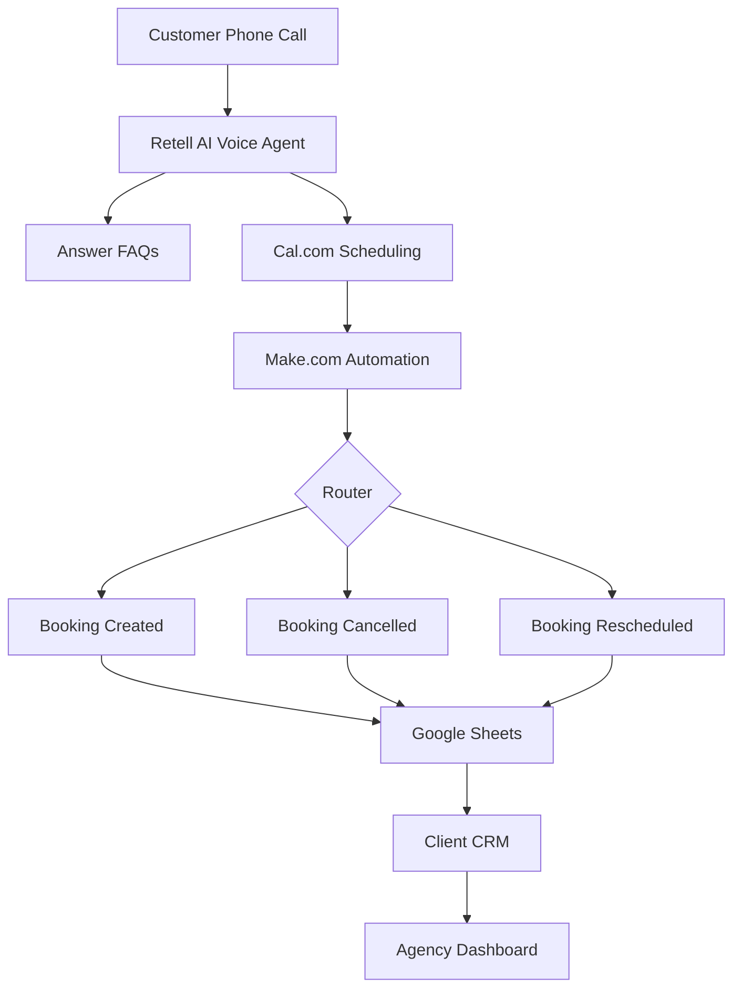

# 🤖 Phoenix AI Voice Receptionist

> **An AI-powered Voice Receptionist & Appointment Automation Platform designed for modern businesses.**  
> Built to automate customer calls, answer FAQs, schedule appointments, and synchronize booking data with CRM systems through intelligent workflow automation.

<p align="center">


</p>

---

# 📖 Project Overview

Phoenix AI Voice Receptionist is an end-to-end AI appointment automation platform built for businesses such as **dental clinics, medical practices, salons, and service providers**.

Instead of hiring a human receptionist to answer every call, businesses can deploy a dedicated AI Voice Agent that naturally interacts with customers, answers frequently asked questions, books appointments, handles cancellations, reschedules existing bookings, and automatically synchronizes all customer information into a dedicated CRM system.

The entire workflow is fully automated using **Retell AI**, **Cal.com**, **Make.com**, **Google Sheets**, and custom-built **Dashboard** & **CRM** applications.

---

# 🚀 Key Features

## 🤖 AI Voice Receptionist

- Human-like natural voice conversations
- Intelligent FAQ handling
- Appointment booking
- Appointment cancellation
- Appointment rescheduling
- Multi-business AI deployment

---

## 📅 Appointment Scheduling

- Real-time booking with Cal.com
- Live availability
- Automatic confirmation
- Calendar synchronization

---

## ⚙️ Workflow Automation

Powered by **Make.com**

### Booking Created

- Receive webhook
- Create booking
- Store customer data
- Update CRM instantly

### Booking Cancelled

- Search existing booking
- Update appointment status
- Sync changes across the CRM

### Booking Rescheduled

- Find existing appointment
- Update date & time
- Save new booking details
- Maintain booking history

---

## 📊 Client CRM

Each client receives their own secure CRM portal where they can:

- View all bookings
- Track appointment status
- Monitor AI performance
- Search customers
- Analyze booking trends
- Review cancellations
- Review rescheduled appointments

---

## 👨‍💼 Admin Dashboard

Designed for the agency.

Monitor:

- Clients
- Active AI Systems
- Monthly Revenue
- Payment Status
- AI Health
- Notifications
- Live Activity
- Revenue Analytics
- Business Growth

---

# 🏗️ System Architecture



---

# 🔄 Workflow

```text
Customer Calls

↓

Retell AI

↓

Natural Conversation

↓

Cal.com

↓

Make.com

↓

Booking Created
Booking Cancelled
Booking Rescheduled

↓

Google Sheets Database

↓

Phoenix CRM

↓

Phoenix Admin Dashboard
```

---

# 🛠️ Technology Stack

| Category | Technology |
|-----------|------------|
| AI | Retell AI |
| Scheduling | Cal.com |
| Automation | Make.com |
| Frontend | React.js |
| Styling | Tailwind CSS |
| Backend | Google Apps Script |
| Database | Google Sheets |
| Charts | Recharts |
| Icons | React Icons |
| Deployment | Netlify |
| Version Control | Git & GitHub |

---

# 📂 Project Structure

```text
AI-Voice-Receptionist-FYP

├── assets/
├── architecture/
├── docs/
├── screenshots/
└── README.md
```

---

# 📸 Project Components

## 🖥️ Phoenix AI Dashboard

Agency dashboard used to manage clients, AI systems, revenue, payments, notifications, and overall business operations.

### Features

- Live Revenue Analytics
- Client Management
- AI System Monitoring
- Payment Tracking
- Notifications
- Activity Feed

---

## 👨‍⚕️ Phoenix AI CRM

Dedicated portal for individual businesses.

### Features

- Booking Dashboard
- Booking Analytics
- Customer Records
- Appointment History
- Cancellation Tracking
- Reschedule Tracking
- AI Performance Monitoring

---

# 🔗 Related Repositories

## 🖥️ Dashboard

https://github.com/Rajaubaid786/Phoenix-AI-Dashboard

---

## 👨‍⚕️ CRM

https://github.com/Rajaubaid786/Phoenix-AI-CRM

---

# 🎯 Future Improvements

- Multi-language AI Support
- Voice Authentication
- Stripe Payment Integration
- SMS Notifications
- WhatsApp Integration
- Email Notifications
- PostgreSQL Support
- Multi-Tenant Architecture
- Role-Based Access Control
- Docker Deployment

---

# 👨‍💻 Developer

**Muhammad Ubaid Roman**

- 🔐 Cybersecurity Engineer
- 💻 MERN Stack Developer
- 🤖 AI Automation Developer

---

## ⭐ If you found this project interesting, consider giving it a Star!
